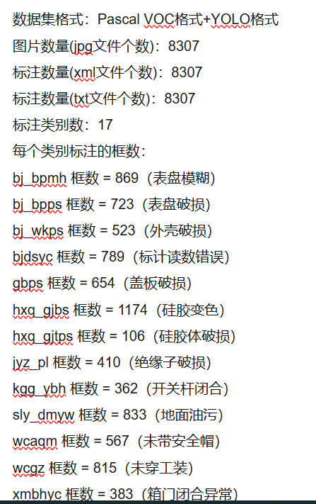
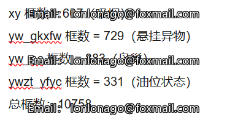
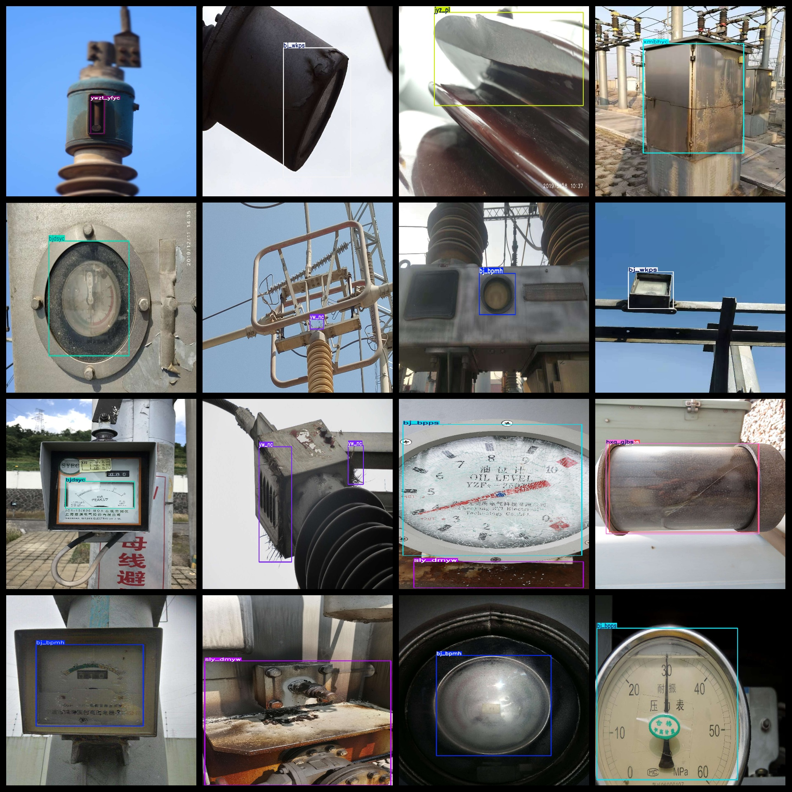
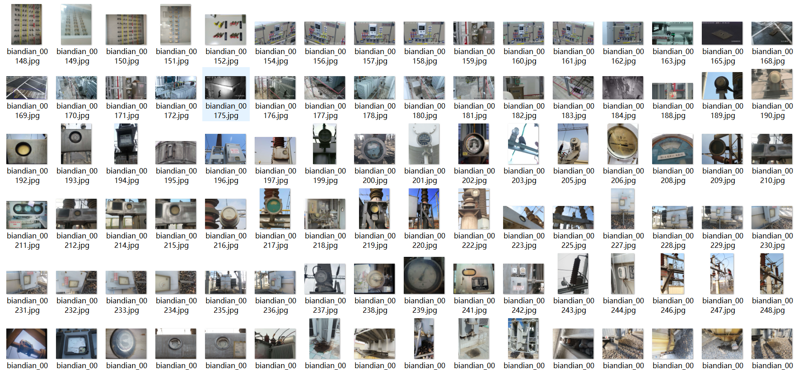
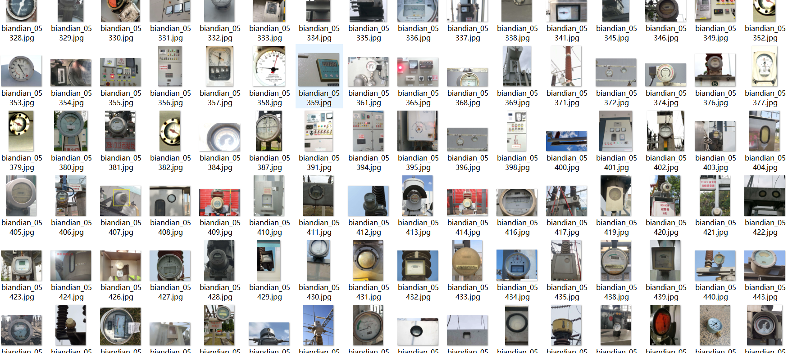

# [Object Detection Dataset] Substation Defect Damage Oil Stain Foreign Object etc Detection Dataset
8300 images, 17-class VOC and YOLO format

Dataset Format: Pascal VOC format + YOLO format

Image Count (jpg file count): 8307

Annotation Count (xml file count): 8307

Annotation Count (txt file count): 8307

Number of Annotation Categories: 17

Box Count per Classification:

bj_bpmh Box Count = 869 (blurry dial)

bj_bpps Box Count = 723 (broken dial)

bj_wkps Box Count = 523 (shell damaged)

bjdsyc Box Count = 789 (reading error in meters)

gbps Box Count = 654 (cover plate damaged)

hxq_gjbs Box Count = 1174 (silicone discoloration)

hxq_gjtps Box Count = 106 (silicone body damage)

jyz_pl Box Count = 410 (insulator damaged)

kgg_ybh Box Count = 362 (switch pole closed)

sly_dmyw Box Count = 833 (ground oil stain)

wcaqm Box Count = 567 (no safety helmet)

wcgz Box Count = 815 (not wearing work clothes)

xmbhyc Box Count = 383 (closed door abnormally)

xy Box Count = 607 (smoking)

yw_gkxfw Box Count = 729 (suspended foreign object)

yw_nc Box Count = 883 (bird nest)

ywzt_yfyc Box Count = 331 (oil level status)

Total Box Count: 10758

Annotation Situations:

## Images

---

Here is a pay link on Stripe (https://buy.stripe.com/3cs8yP7sY87d0vu9AB). Please contact me lonlonago@foxmail.com after funding $89, and I will send you a complete data files, thank you!

